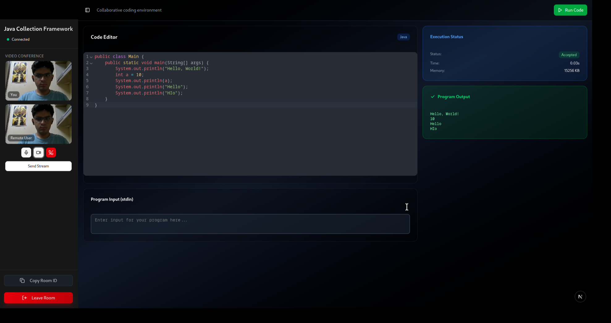
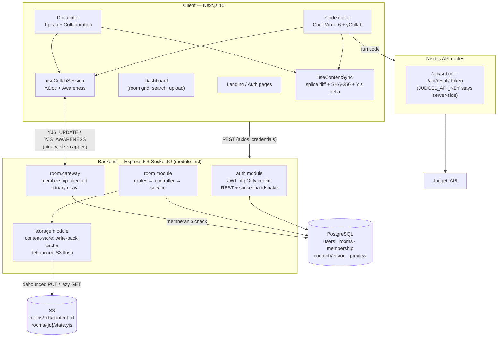
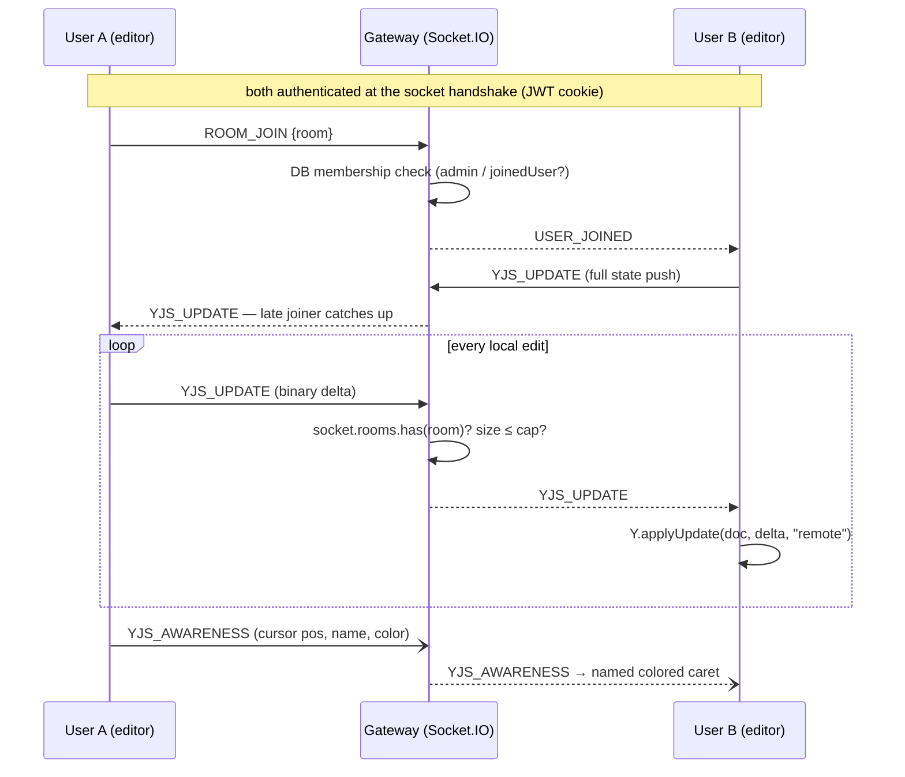
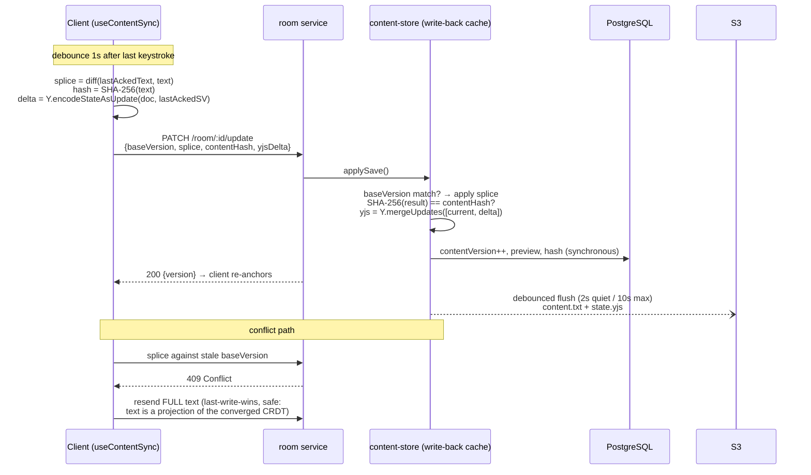
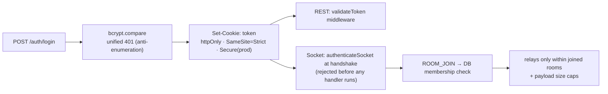

# CollabCode 🚀

A real-time collaborative workspace where two people code or write together — live CRDT-synced editing with named cursors, in-browser code execution across 9 languages, and a diff-based persistence pipeline backed by PostgreSQL and S3.

<!-- Screenshot: drop a current-UI capture at ss/ss.png and restore:
 -->

## ✨ Features

- **Conflict-free real-time editing** — both users type simultaneously; edits merge via CRDTs (Yjs), never overwrite
- **Live presence** — every collaborator gets a stable personal color and a name label pinned to their cursor, in both editors
- **Two room types** — code rooms (CodeMirror 6 + Judge0 execution) and doc rooms (TipTap rich-text with a Google-Docs-style toolbar)
- **Instant code execution** — 9 languages via the Judge0 API with an async submit–poll pipeline
- **Diff-based persistence** — saves ship a minimal text splice + an incremental CRDT delta, not the whole file
- **File upload & export** — upload local files into rooms; download code with the right extension, docs as `.doc`/`.html`/`.txt`
- **Google-Docs-style dashboard** — searchable room grid with live code-preview thumbnails
- **Secure by default** — JWT in httpOnly cookies for REST *and* the socket handshake, DB-verified room membership before any relay

## 🛠️ Tech Stack

| Layer | Technology |
|---|---|
| Frontend | Next.js 15, React 19, TypeScript, Tailwind v4, shadcn/ui |
| Editors | CodeMirror 6 (`y-codemirror.next`), TipTap (`extension-collaboration` + `collaboration-caret`) |
| Real-time | Socket.IO, Yjs (CRDT) + y-protocols awareness |
| Backend | Node.js, Express 5, TypeScript (module-first architecture) |
| Database | PostgreSQL via Prisma 7 (`@prisma/adapter-pg`, Rust-engine-free) |
| Object storage | AWS S3 (content + serialized CRDT state), MinIO-compatible for local dev |
| Execution | Judge0 (RapidAPI), server-side key custody |
| Data fetching | TanStack Query, Axios |

## 🏗️ High-Level Design



**Separation of concerns:** Postgres owns *metadata and coordination* (identity, membership, the content version counter). S3 owns *bulk bytes* (document text, CRDT state). The Socket.IO gateway owns *ephemeral relay* and holds zero document state. Judge0 calls never touch the backend — they run through Next.js route handlers so the API key never reaches the browser.

## 🔄 System Design Deep-Dives

### 1. Real-time collaboration (CRDT)

Document sync is conflict-free by construction: both editors bind to a shared `Y.Doc`, and Yjs (YATA algorithm) guarantees every replica converges to the identical state regardless of message order — Strong Eventual Consistency.



Key properties:
- **The server is a dumb relay** — it never materializes documents, so scaling it means scaling message fan-out, not document computation
- **Echo loops are prevented by origin tags**: remote updates are applied with `origin="remote"`, and the local update listener skips that origin
- **Awareness (cursors, names, colors) is ephemeral** — a separate protocol that auto-expires, never persisted
- **Per-user undo** — `Y.UndoManager` tracks origins, so Ctrl+Z undoes only your own edits

### 2. Persistence: diff sync → Postgres + S3

S3 objects are immutable, so "sync diffs to S3" really means: **diffs cut client→server bandwidth; the server materializes state in a write-back cache and flushes full objects to S3 on a debounce.**



Design decisions worth knowing:
- **The correctness triangle**: splice (minimal payload) + `baseVersion` (optimistic ordering) + SHA-256 (integrity). A wrong diff can be *rejected*, never silently persisted
- **`Y.mergeUpdates` is a pure function over binary updates** — the server maintains canonical CRDT state without instantiating a Y.Doc, so it doesn't care whether the room is code or rich text
- **Postgres is the version authority** (updated synchronously, one cheap row); S3 takes the heavy bytes on a debounce because it bills per PUT and hates chatty writes
- **Durability window** = the debounce interval, bounded by a 10s max-delay and a flush on SIGINT/SIGTERM
- **`preview` column** (first 500 chars, denormalized) lets the dashboard render N thumbnails with zero S3 reads
- **Known limit**: the cache is in-process (single-writer). Horizontal scaling requires Redis or sticky room routing — a deliberate, documented trade-off

### 3. Authentication & security



- One cookie authenticates both transports — no token in localStorage (XSS-safe), SameSite=Strict (CSRF)
- Registration relies on the **DB unique constraint** (`P2002` → 409), not check-then-insert
- The 2-user room seat is claimed with a **conditional update** (`WHERE joinedUserId IS NULL`) so concurrent joins can't both win
- Judge0 key, DB, and S3 credentials never leave the server

### 4. Code execution pipeline

```
Editor → POST /api/submit (Next.js route) → Judge0 → token
       → GET /api/result/:token (poll until status > 2) → stdout/stderr/compile output
```

Async submit–poll rather than blocking: Judge0 queues submissions, and polling from the client keeps serverless route handlers short-lived.

### 5. Data model

```prisma
model User {
  id       String @id @default(uuid())
  username String
  email    String @unique
  password String            // bcrypt, hashed in the service layer
  ownedRooms  Room[] @relation("RoomAdmin")
  joinedRooms Room[] @relation("RoomMember")
}

model Room {
  id             String   @id @default(uuid())
  name           String
  type           RoomType @default(CODE)   // CODE | DOC
  language       Int?                       // Judge0 id, code rooms only
  adminId        String                     // owner (cascade delete)
  joinedUserId   String?                    // the one seat (2-user rooms)
  contentVersion Int      @default(0)       // optimistic lock for diff sync
  contentHash    String?                    // SHA-256 integrity
  preview        String?  @db.VarChar(500)  // dashboard thumbnails, no S3 read
}
```

Content itself lives in S3: `rooms/{id}/content.txt` (derived text/HTML) and `rooms/{id}/state.yjs` (the CRDT source of truth for late-joiner hydration).

## 🚀 Getting Started

### Prerequisites

- Node.js 18+
- PostgreSQL (local or hosted)
- An S3 bucket — or [MinIO](https://min.io/) locally
- A [Judge0 RapidAPI](https://rapidapi.com/judge0-official/api/judge0-ce) key

### Setup

```bash
git clone https://github.com/ritik6559/CollabCode.git
cd CollabCode

# install
cd frontend && npm install && cd ../backend && npm install

# configure
cp .env.example .env          # backend — fill DATABASE_URL, JWT_SECRET, S3 vars
# frontend/.env.local — JUDGE0_API_KEY, NEXT_PUBLIC_API_URL, NEXT_PUBLIC_BACKEND_URL

# database
npx prisma migrate dev --name init

# run (two terminals)
npm run dev                   # backend :8000
cd ../frontend && npm run dev # frontend :3000
```

For local S3, start MinIO and set `S3_ENDPOINT=http://localhost:9000` in `backend/.env`.

## 📁 Project Structure

```
frontend/
├── app/                # Next.js App Router (landing, auth, dashboard, editors)
├── features/           # feature modules: auth, dashboard, editor, doc, landing
├── hooks/              # useCollabSession (CRDT), useCodeExecution
└── lib/                # diff protocol, collab colors, download, api helpers

backend/
├── prisma/             # schema + migrations
└── src/
    ├── modules/
    │   ├── auth/       # JWT (REST + socket), user service
    │   ├── room/       # routes/controller/service + socket gateway
    │   └── storage/    # S3 client, write-back content store, text diff
    ├── common/         # ApiError, asyncHandler, errorHandler, validators
    └── db/             # Prisma client (driver adapter)
```

## ⚖️ Trade-offs & Scaling Path

| Current design | Why | At scale |
|---|---|---|
| In-process content cache | Simple, zero infra | Redis or sticky room routing |
| Socket.IO single instance | 2-user rooms, low fan-out | Redis adapter + sticky sessions |
| Debounced S3 flush | S3 bills per PUT | Same, plus S3 versioning for history |
| Full snapshot on S3 | Immutable objects | Append-only Yjs update log + compaction |
| 2 users per room | Product choice, not CRDT limit | Yjs scales to N; lift the seat check |

---
**Built with ❤️ by Ritik**
